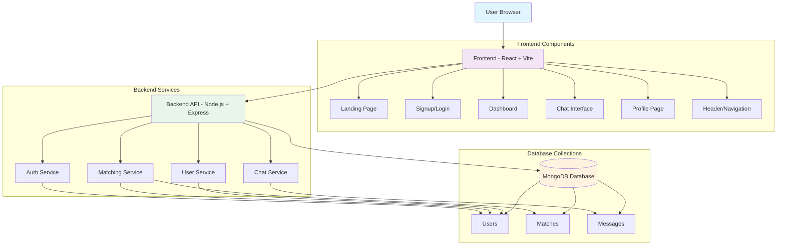

```mermaid
graph TB
    A[User Browser] --> B[Frontend - React + Vite]
    B --> C[Backend API - Node.js + Express]
    C --> D[(MongoDB Database)]
    
    subgraph Frontend Components
        B --> E[Landing Page]
        B --> F[Signup/Login]
        B --> G[Dashboard]
        B --> H[Chat Interface]
        B --> I[Profile Page]
        B --> J[Header/Navigation]
    end
    
    subgraph Backend Services
        C --> K[User Service]
        C --> L[Matching Service]
        C --> M[Chat Service]
        C --> N[Auth Service]
    end
    
    subgraph Database Collections
        D --> O[Users]
        D --> P[Matches]
        D --> Q[Messages]
    end
    
    K --> O
    L --> O
    L --> P
    M --> Q
    N --> O
    
    style A fill:#e1f5fe
    style B fill:#f3e5f5
    style C fill:#e8f5e8
    style D fill:#fff3e0
```