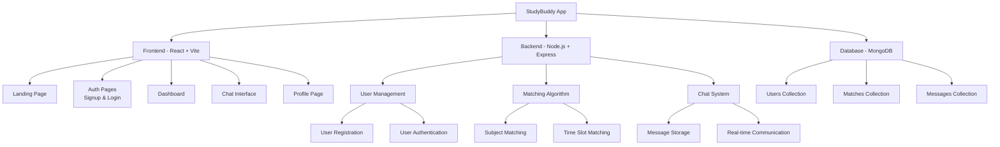

```mermaid
graph TD
    A[StudyBuddy App] --> B[Frontend - React + Vite]
    A --> C[Backend - Node.js + Express]
    A --> D[Database - MongoDB]
    
    B --> E[Landing Page]
    B --> F[Auth Pages<br/>Signup & Login]
    B --> G[Dashboard]
    B --> H[Chat Interface]
    B --> I[Profile Page]
    
    C --> J[User Management]
    C --> K[Matching Algorithm]
    C --> L[Chat System]
    
    J --> M[User Registration]
    J --> N[User Authentication]
    
    K --> O[Subject Matching]
    K --> P[Time Slot Matching]
    
    L --> Q[Message Storage]
    L --> R[Real-time Communication]
    
    D --> S[Users Collection]
    D --> T[Matches Collection]
    D --> U[Messages Collection]
```